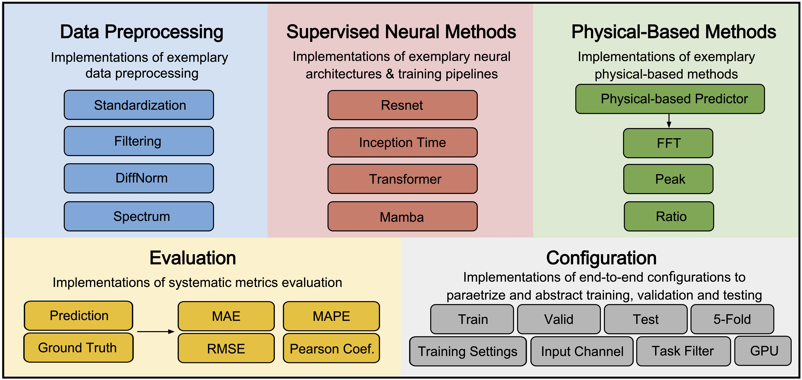
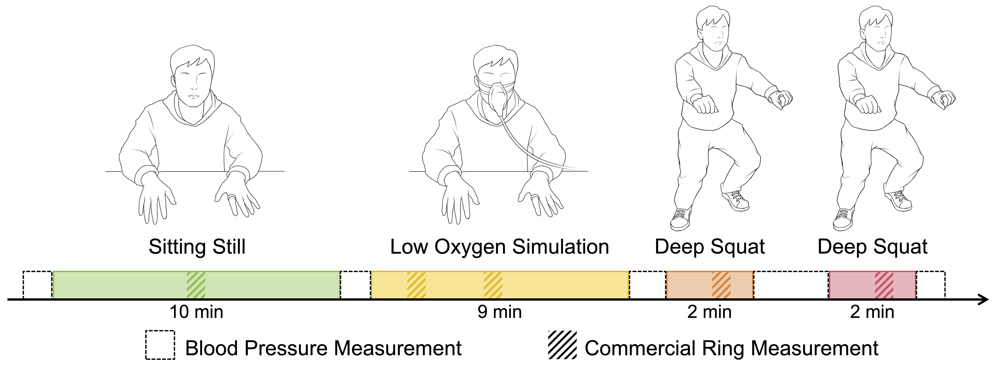
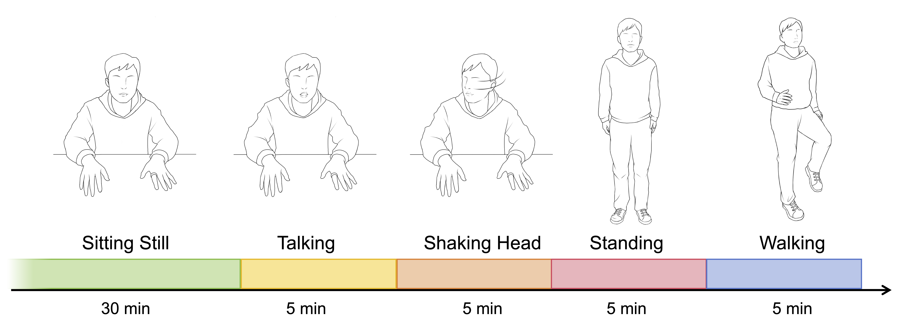

# 💍 RingTool
RingTool is an open platform for health sensing and data analysis with smart rings. It processes raw **PPG** and **IMU** signals from ring sensors to estimate cardiovascular parameters (HR, RR, SpO2, BP). It offers configurable modules for data preprocessing, physics-based algorithms, supervised learning models (**ResNet**, **InceptionTime**, **Transformer**, **Mamba**), and systematic evaluation. The platform is designed to be flexible and extensible, allowing the community to build custom solutions for a wide range of health and wellness applications.



## ✨ Features
### ⚙️ Toolkit Configuration
Built with Python/PyTorch, RingTool allows customization of:
* **Data Splits:** Train/validation/test sets, k-fold cross-validation.
* **Training:** Learning rate, batch size, optimizer, epochs.
* **I/O:** Select sensor channels (PPG wavelengths, IMU) and target outputs (HR, RR, SpO2, BP).
* **Methods:** Choose between physics-based and supervised learning approaches.
* **Filtering:** Parameter-specific filter settings.

### 🔄 Data Preprocessing
A configurable pipeline prepares raw signals:
* **Windowing:** Segments data (default: 30s, >95 Hz sampling rate).
* **Standardization:** Zero-mean, unit-variance normalization.
* **Filtering:** Band-pass Welch filter (HR: $0.5-3$ Hz, RR: $0.1-0.5$ Hz).
* **DiffNorm:** Differentiation + normalization to enhance periodic signals.
* **Spectral Analysis:** Frequency-domain transformation.

### 🔍 Physics-based Methods
RingTool includes traditional signal processing algorithms:
* **Peak Detection:** Estimates HR/RR from detected peaks in filtered signals.

```math
\text{Rate (per minute)} = \frac{60 \times \text{Number of peaks}}{\text{Window duration (seconds)}}
```
* **Fast Fourier Transform (FFT):** Estimates HR/RR from the peak frequency ($f_{peak}$) in the signal's spectrum.

```math
\text{HR (bpm)} = 60 \times f_{peak} \quad (f_{peak} \in [0.5, 3] \text{ Hz})
```

```math
\text{RR (breaths/min)} = 60 \times f_{peak} \quad (f_{peak} \in [0.1, 0.5] \text{ Hz})
```
* **Ratio-Based SpO2:** Calculates SpO2 using the ratio of AC/DC components from red and infrared PPG signals.

```math
R = \frac{AC_{red}/DC_{red}}{AC_{infrared}/DC_{infrared}}
```

```math
\text{SpO2 (\%)} = a - b \times R
```

(Coefficients $a, b$ depend on sensor type, e.g., $a \approx 99, b \approx 6$ for reflective; $a \approx 87, b \approx -6$ for transmissive).


All code for physics-based methods is implemented in [`unsupervised`](unsupervised).


### 🚆 Supervised Methods
#### Deep Learning Models
RingTool includes four deep learning backbones adapted for multi-channel physiological time-series regression:

* **ResNet (He et al., 2016):** Uses residual connections to enable deeper networks for complex regression tasks (e.g., BP estimation) by mitigating vanishing gradients. Configurable depth, filters, etc. See [`nets/resnet.py`](nets/resnet.py).
* **InceptionTime (Ismail Fawaz et al., 2020):** Employs multi-scale convolutional filters to capture patterns at different temporal resolutions simultaneously (e.g., fast cardiac events and slow respiratory cycles). Configurable modules, kernel sizes. See [`nets/inception_time.py`](nets/inception_time.py).
* **Transformer (Vaswani et al., 2017):** Leverages self-attention to model complex, long-range dependencies within and across channels, useful for signals with extended temporal variations. Configurable heads, layers. See [`nets/transformer.py`](nets/transformer.py).
* **Mamba (Gu & Dao, 2023):** A recent state space model offering linear-time complexity for long sequences and potentially better handling of motion artifacts via selective state updates. Configurable state dimension, blocks. See [`nets/mamba2.py`](nets/mamba2.py).

#### Training Protocol
A standardized framework is used:
* **Tasks:** Single-task regression (HR, RR, SpO2, BP).
* **Validation:** 5-fold cross-validation (subject-independent).
* **Defaults:** 200 epochs, batch size 128, MSE loss, Adam optimizer (LR $1 \times 10^{-3}$).
* **Optimization:** Supports hyperparameter tuning, uses validation set performance for model selection (best epoch saved), includes early stopping.
* **Evaluation Metrics:** MAE, RMSE, MAPE, Pearson correlation coefficient.


## 🚀 Usage
### 📋 Prerequisites
The project depends on several Python libraries and tools, including [`PyTorch`](https://github.com/pytorch/pytorch), [`mamba-ssm`](https://github.com/state-spaces/mamba), [`Triton`](https://github.com/triton-lang/triton) etc. You can install these dependencies manually in your environment or using our [`requirements.txt`](requirements.txt).


## 📊 Dataset
Visualization of ring signal and corresponding medical ground truth.


> **Stimulus-evoked data collection procedure across physiological states.** The protocol consists of three main activities: (1) A 10-minute seated resting, (2) A 9-minute supervised low-oxygen simulation, and (3) Two 2-minute sessions of deep squat exercises. Blood pressure measurements were taken before and after each activity, while physiological data was continuously recorded by our custom rings and periodically measured by commercial rings for comparison.


> **Data collection procedure across daily activities.** The protocol consists of five activity segments: (1) A 30-minute seated resting, (2) 5-minute sitting and talking, (3) 5-minute head movement, (4) 5-minute standing, and (5) 5-minute walking in place. Participants wore the oximeter, Ring 1 (reflective), Ring 2 (transmissive), and respiratory band throughout all activities.



<!-- **Prevent pushing pyc files into Git**.
```sh
pip install pre-commit
pre-commit install
```
1. **Installation**: To use RingTool, you need to install the required libraries and dependencies. You can do this by running the following command:
   ```bash
   pip install -r requirements.txt
   ```
2. **Data Collection**: Put your data under the `data` folder. The data should be npy format. 
``` 
data_daily.npy (data_sport.npydata_health.npy) 
- subject
  ring1: timestamp,green,ir,red,ax,ay,az
  ring2: timestamp,green,ir,red,ax,ay,az
  bvp: timestamp,bvp
  hr: timestamp,hr
  spo2: timestamp,spo2
  resp: timestamp,resp
  ecg: timestamp,ecg
  ecg_hr: timestamp,ecg_hr
  ecg_rr: timestamp,ecg_rr
  samsung: timestamp,hr
  oura: start, end, hr
  BP: start, end,sys,dia
  Experiment: Health, Daily, Sport
  Labels: start, end, label
```
3. **Configuration**: Configure the parameters for data collection and analysis in the `config` folder. You can specify the Health metrics, and activity settings.
4. **Train**: TODO
5. **Evaluate**: TODO -->
