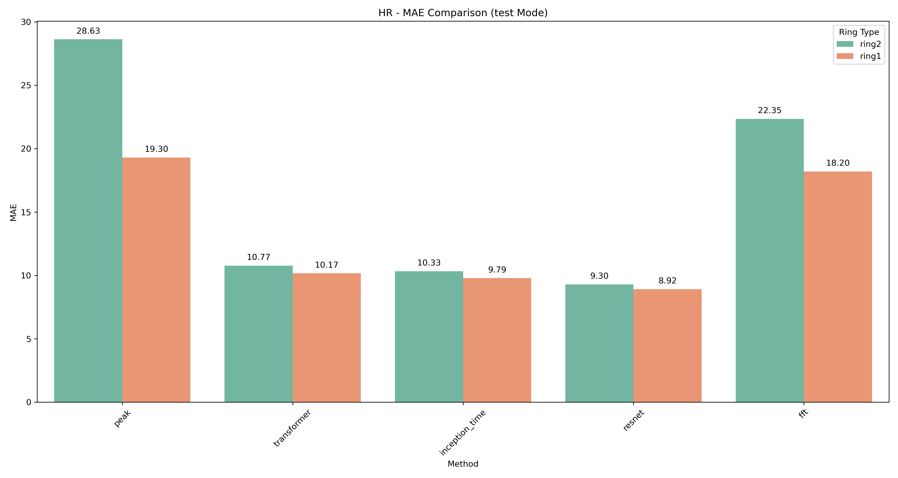
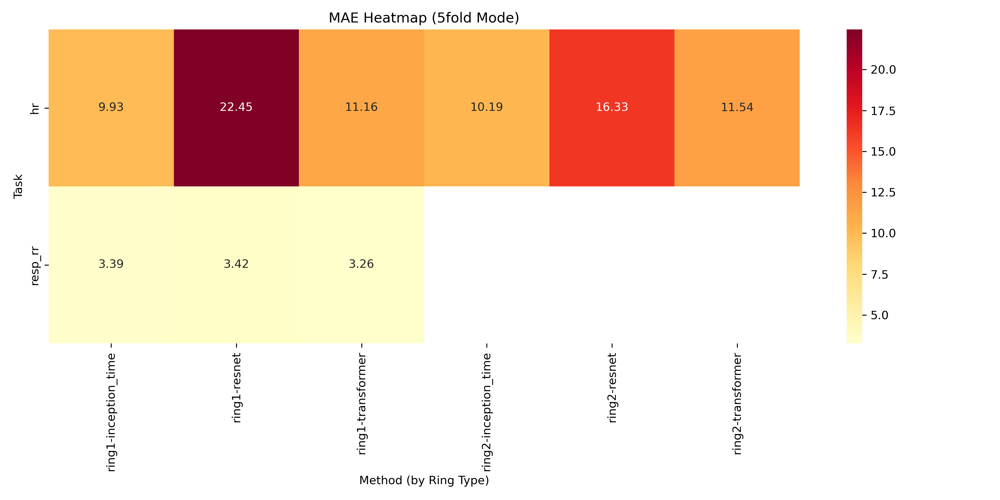
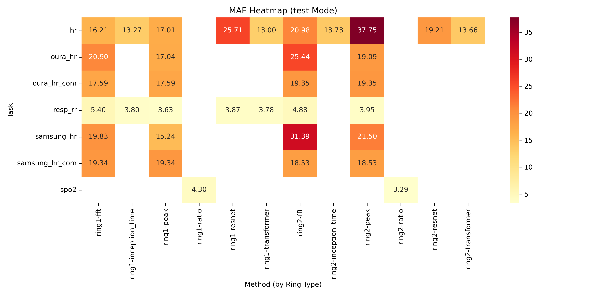

# RingTool Reproduction

This repository is a fork of [thuhci/RingTool](https://github.com/thuhci/RingTool), reproducing experiments for physiological signal prediction using wearable ring devices. The replication includes physics-based (Peak, fft) and supervised learning models (ResNet, InceptionTime, Mamba2, Transformer) with 5-fold cross-validation and test-mode evaluations, validated on the Kaggle Ring Dataset.

## Experiment Setup

- **Environment**:
  - **OS**: Ubuntu Linux
  - **Hardware**: 4x NVIDIA RTX 4090, CUDA 12.4
  - **Python**: 3.10.16 (Conda environment: `ringtool`)
  - **Key Dependencies**:
    - `torch==2.1.2+cu121`
    - `mamba_ssm==2.2.4`
    - `numpy==1.26.4`
    - `pandas==2.2.3`
    - Full list in [`requirements.txt`](requirements.txt)
- **Dataset**: [Kaggle Ring Dataset](https://www.kaggle.com/datasets/ringdataset/ring-dataset)
  - 7 subjects (`00005`, `00009`, `00012`, `00020`, `00022`, `00029`, `00031`)
  - Tasks: Heart rate (`hr`, `samsung_hr`, `oura_hr`), respiratory rate (`resp_rr`), SpO2 (`spo2`), blood pressure (`BP_sys`, `BP_dia`)
  - Stored in `/root/RingTool/data/rings/` (e.g., `00005_ring1_processed.pkl`)
- **Configurations**:
  - 33 supervised configs in `/config/supervised/` (ResNet, InceptionTime, Mamba2, Transformer)
  - Test-mode configs in `/config/only_test/`
  - Physical-based configs in `/config/physical-based/` (Peak, fft, Ratio)
  - Total: 148 experiments processed (merged into `all_results.csv`)
- **Scripts**:
  - [`update_configs.ipynb`](update_configs.ipynb): Updates JSON configuration files with subject splits for 5-fold cross-validation
  - [`resultsCollection.ipynb`](resultsCollection.ipynb): Merges results into `all_results.csv`
  - [`dataAnalysis.ipynb`](dataAnalysis.ipynb): Analyzes and visualizes results

## Results

- **Progress**: (33 supervised with 5-fold cross-validation, test-mode, and physical-based).
- **Metrics**: Analyzed in `dataAnalysis.ipynb`, stored in `all_results.csv` .
- **Key Findings**:
  - Performance Table (Test Mode)

    | Task       | Ring Type | Best Method  | MAE       | Task       | Ring Type | Best Method  | MAE       |
    |------------|-----------|--------------|-----------|------------|-----------|--------------|-----------|
    | hr         | ring1     | fft          | 16.213333 | hr         | ring2     | fft          | 20.976667 |
    | hr         | ring1     | inception_time| 13.273333 | hr         | ring2     | inception_time| 13.733333 |
    | hr         | ring1     | peak         | 17.010000 | hr         | ring2     | peak         | 37.753333 |
    | hr         | ring1     | resnet       | 25.706667 | hr         | ring2     | resnet       | 19.213334 |
    | hr         | ring1     | transformer  | 13.003333 | hr         | ring2     | transformer  | 13.660000 |
    | oura_hr    | ring1     | fft          | 20.903333 | oura_hr    | ring2     | fft          | 25.443333 |
    | oura_hr    | ring1     | peak         | 17.040000 | oura_hr    | ring2     | peak         | 19.093333 |
    | oura_hr_com| ring1     | fft          | 17.590000 | oura_hr_com| ring2     | fft          | 19.350000 |
    | oura_hr_com| ring1     | peak         | 17.590000 | oura_hr_com| ring2     | peak         | 19.350000 |
    | resp_rr    | ring1     | fft          | 5.400000  | resp_rr    | ring2     | fft          | 4.875000  |
    | resp_rr    | ring1     | inception_time| 3.800000  | resp_rr    | ring2     | inception_time| 3.953333  |
    | resp_rr    | ring1     | peak         | 3.630000  | resp_rr    | ring2     | peak         | 3.953333  |
    | resp_rr    | ring1     | resnet       | 3.866667  | resp_rr    | ring2     | resnet       | 3.953333  |
    | resp_rr    | ring1     | transformer  | 3.776667  | resp_rr    | ring2     | transformer  | 4.875000  |
    | samsung_hr | ring1     | fft          | 19.833333 | samsung_hr | ring2     | fft          | 31.386667 |
    | samsung_hr | ring1     | peak         | 15.236667 | samsung_hr | ring2     | peak         | 21.496667 |
    | samsung_hr_com| ring1  | fft          | 19.336667 | samsung_hr_com| ring2  | fft          | 18.533333 |
    | samsung_hr_com| ring1  | peak         | 19.336667 | samsung_hr_com| ring2  | peak         | 18.533333 |
    | spo2       | ring1     | ratio        | 4.300000  | spo2       | ring2     | ratio        | 3.290000  |

- **Visualizations**:
  - MAE barplots per task/mode (e.g., `output/mae_barplot_hr_test.png`):
    
  - MAE heatmaps per mode (e.g., `output/mae_heatmap_5fold.png`):
    
  - MAE heatmaps per mode (e.g., `output/mae_heatmap_test.png`):
    
- **Logs**: Experiment progress in [`experiment.log`](experiment.log), model outputs in [`logs/`](logs/), completed configs in [`completed_configs.txt`](completed_configs.txt).

## How to Run

1. **Setup Environment**:
   ```bash
   conda create -n ringtool python=3.10.16
   conda activate ringtool
   pip install -r requirements.txt
   pip install torch==2.1.2 torchvision==0.16.2 torchaudio==2.1.2 --index-url https://download.pytorch.org/whl/cu118
   pip install mamba-ssm==2.2.4 --no-build-isolation
   ```

2. **Download Dataset**:
   - Download from [Kaggle](https://www.kaggle.com/datasets/ringdataset/ring-dataset).
   - Unzip and place in `/root/RingTool/data/rings/`:
     ```bash
     mkdir -p /root/RingTool/data/rings
     mv path/to/ring-dataset/* /root/RingTool/data/rings/
     ```

3. **Update Configurations**:
   - Run the notebook to update JSON configs with 5-fold splits:
     ```bash
     jupyter notebook update_configs.ipynb
     ```

4. **Run Physics-Based Methods**:
   ```bash
   python3 main.py --data-path /root/RingTool/data/rings --batch-configs-dirs config/physical-based
   ```

5. **Run Supervised Methods**:
   ```bash
   nohup python3 main.py --data-path /root/RingTool/data/rings --batch-configs-dirs config/supervised > $(date +%Y%m%d%H%M%S)-nohup-train.log 2>&1 &
   ```

6. **Run Test-Mode Experiments**:
   ```bash
   nohup python3 main.py --data-path /root/RingTool/data/rings --batch-configs-dirs config/only_test > $(date +%Y%m%d%H%M%S)-nohup-test.log 2>&1 &
   ```

7. **Analyze Results**:
   ```bash
   jupyter notebook resultsCollection.ipynb
   jupyter notebook dataAnalysis.ipynb
   ```
## Acknowledgments
- Gratitude to the [thuhci/RingTool](https://github.com/thuhci/RingTool) team at Tsinghua University for their codebase and documentation.
- This work utilized the [Kaggle Ring Dataset](https://www.kaggle.com/datasets/ringdataset/ring-dataset) for validation.
- Conducted by Fu Jingyu as part of a replication study.